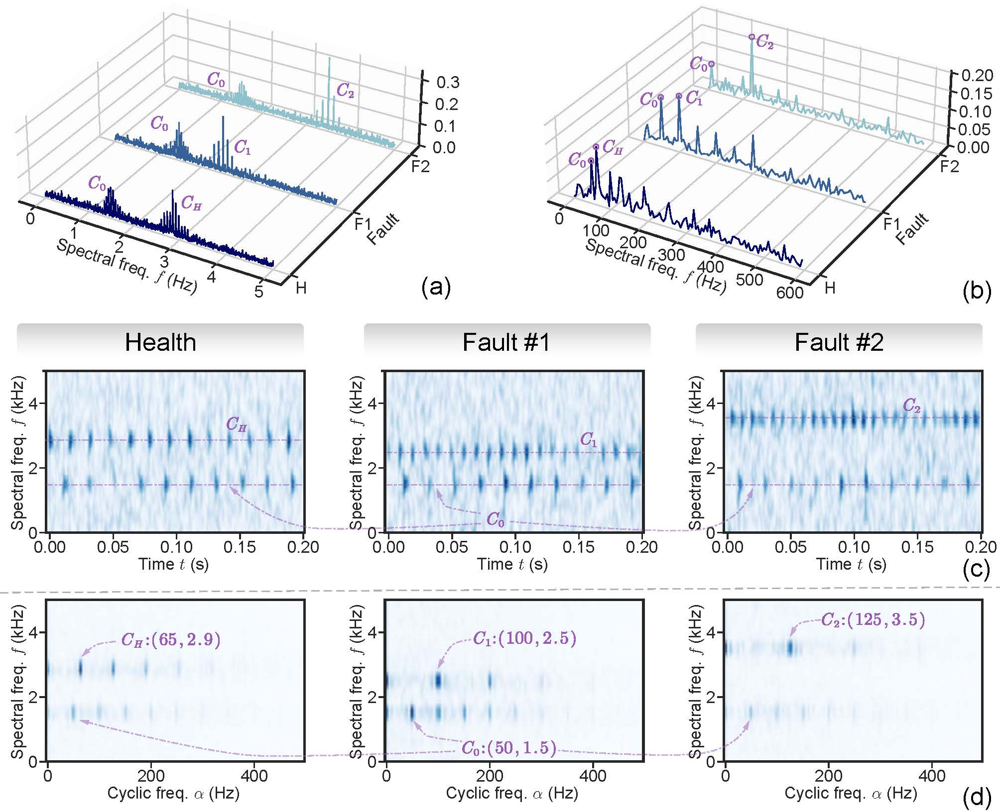
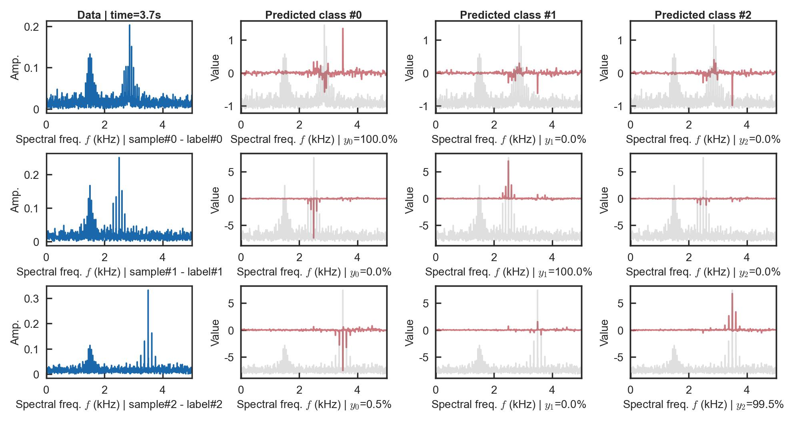
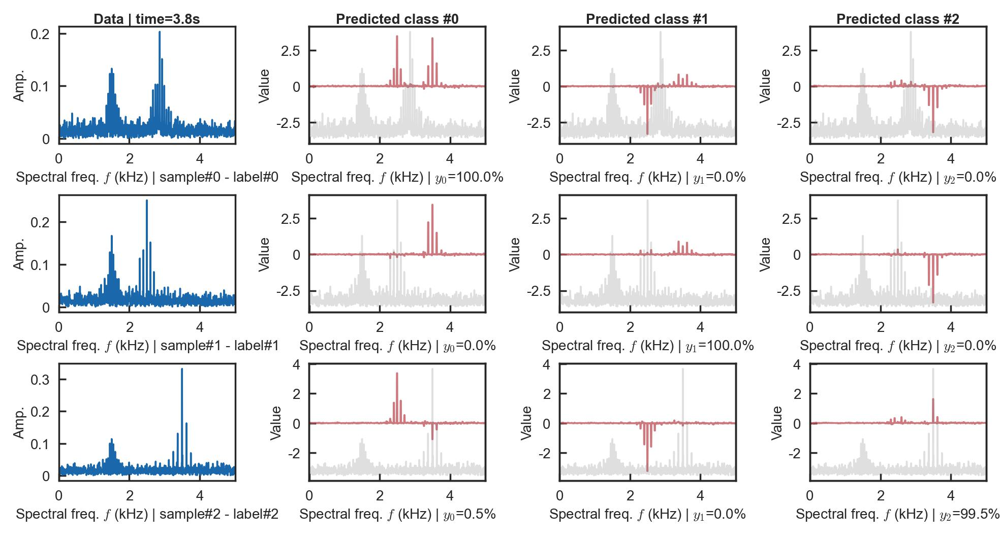
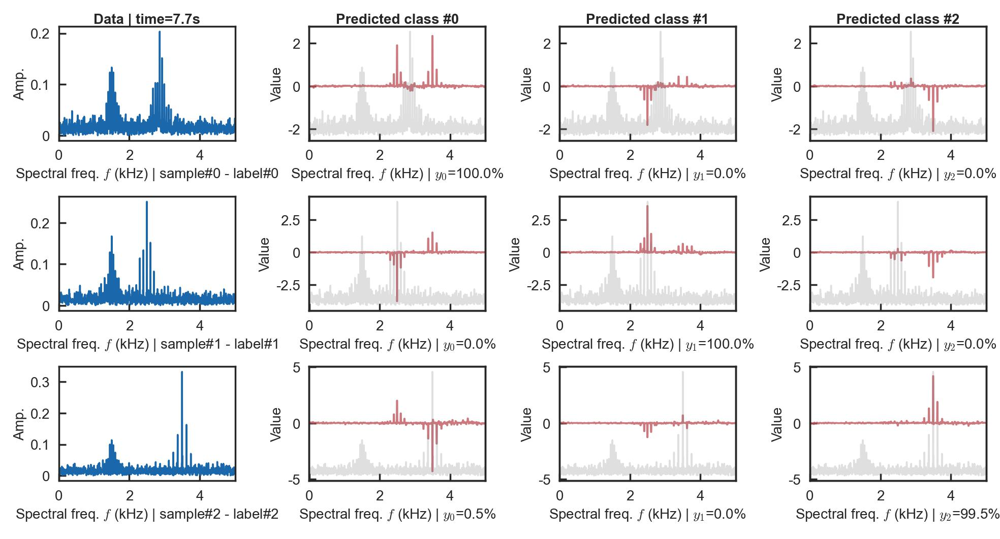
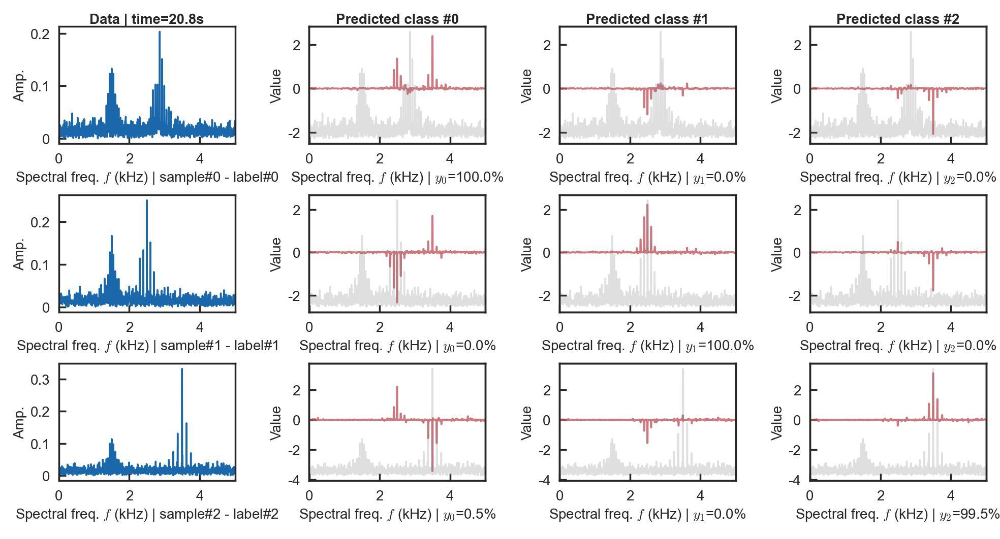
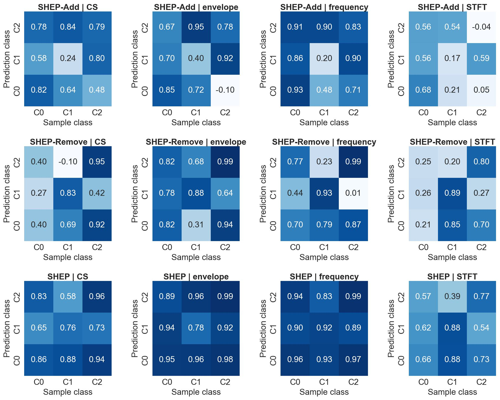
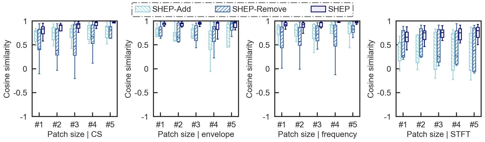
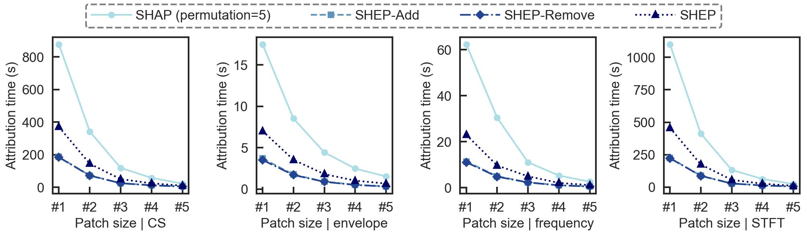

# SHEP
**Open-source implementation of the paper:**  
*"SHapley Estimated exPlanation (SHEP): A Fast Post-Hoc Attribution Method for Interpreting Intelligent Fault Diagnosis"* [](https://arxiv.org/abs/2504.03773) 

> Despite significant progress in intelligent fault diagnosis (IFD), the lack of interpretability remains a critical barrier to practical industrial applications, driving the growth of interpretability research in IFD. Post-hoc interpretability has gained popularity due to its ability to preserve network flexibility and scalability without modifying model structures. However, these methods often yield suboptimal time-domain explanations. Recently, combining domain transforms with SHAP has improved interpretability by extending explanations to more informative domains. Nonetheless, the computational expense of SHAP, exacerbated by increased dimensions from domain transforms, remains a major challenge.
>
> To address this, we propose patch-wise attribution and SHapley Estimated Explanation (SHEP). Patch-wise attribution reduces feature dimensions at the cost of explanation granularity, while SHEP simplifies subset enumeration to approximate SHAP, reducing complexity from exponential to linear. Together, these methods significantly enhance SHAP's computational efficiency, providing feasibility for real-time interpretation in monitoring tasks. Extensive experiments confirm SHEP's efficiency, interpretability, and reliability in approximating SHAP. Additionally, with open-source code, SHEP has the potential to serve as a benchmark for post-hoc interpretability in IFD.

### Notes
* 2025-04-29: The code of **SHEP** with **full demo** under different **domains** and **patch sizes** is uploaded.
* 2025-04-03: The preprint is available on [](https://arxiv.org/abs/2504.03773).
* 2025-01-15: We will upload our code after the paper is accepted.

## Repository Structure  
### Core Code  
- **`SHEPs/MultiDomain_Attribution.py`**: Implementation of **multi-domain multi-method attribution** (**Time/Freq/Env/TF/CS** domain & **SHEP/SHAP** method).  
- **`SHEPs/Attribution_methods.py`**: code of SHEP and SHAP. 
- **`SHEPs/DomainTransform.py`**: Signal processing of domain transforms and **patch**-wsie attribution technique. 
- **`SHEPs/utils_SHAP_MyIndependent.py`**: Modified SHAP utilities to support `numpy.ndarray` with `dtype=object`.

### Demo Code  
Besides, we also provide **Demo Code**  of the simulation dataset and CWRU dataset. Run the Demo, and you will get the same experimental results as descripted in  [](https://arxiv.org/abs/2504.03773).

The repo structure is organized as follows:
```
├── Demo # the demo code of of the simulation dataset and CWRU dataset
│   ├── Datasets
│   ├── Models
│   ├── checkpoint
│   ├── train.py                      # 1) training the NN model
│   ├── Demo_attribution_statistic.py # 2) demo code of full attribution analysis and statistic the result
│   └── Demo_attribution.py           # 2) demo code of single attribution analysis
└── SHEPs
    ├── Attribution_methods.py      # SHEP and SHAP
    ├── DomainTransform.py          # signal processing (high-level)
    ├── MultiDomain_Attribution.py  # the main file of multi-domain multi-method attribution analysis
    ├── plot_func.py
    ├── utils_SHAP_MyIndependent.py # shap package modification to support numpy.ndarray with dtype=object
    ├── utils_Transform.py          # signal processing (low-level)
    └── utils_Visualization.py      # visualizating the attribution result
```

## Quick Start

### 1. Install Dependencies
```bash
conda create -n env-SHAP python=3.12.3
conda activate env-SHAP
conda install numpy=1.26.4
pip3 install torch torchvision torchaudio --index-url https://download.pytorch.org/whl/cu118
conda install pandas matplotlib seaborn openpyxl scipy=1.13.1 scikit-learn shap=0.42.1
```


### 2. Download Datasets
**Simulation**: Auto-generated (saved to `Demo/Datasets/Buffer-SimulationDataset`).

**CWRU**：

* Official: [Case School of Engineering](https://engineering.case.edu/bearingdatacenter/download-data-file);
* Mirror: [Baidu NetDisk](https://pan.baidu.com/s/1Q7vXZi3BG6205nzKO57scg?pwd=riah) |  [Kuake NetDisk](https://pan.quark.cn/s/7334676ce5be).
* Organize as follows:
  ```
  $CWRU_dir$ 
  ├── 12k Drive End Bearing Fault Data
  ├── 12k Fan End Bearing Fault Data
  ├── 48k DE fault data and normal baseline data
  ├── 48k Drive End Bearing Fault Data
  └── Normal Baseline Data
  ```

### 3. Run Demos
**Step 1: train the model**:
``` bash
# step 0: set the python environment as above, and set current path to the project path

# step 1: train the model for simulation dataset
python Demo/train.py --data_name 'Simulation'

# (step 1): Or train the model for CWRU dataset, but you need set the CWRU directory at the same time
python Demo/train.py --data_name 'CWRU' --data_dir $CWRU_dir$  
```
The result is located in `Demo/checkpoint/$checkpoint_name$`.

**Step 2: conduct attribution analysis**:

you can choose different **attribution-method** / **patch-level** / **domain** to analyse the model in `$checkpoint_name$`.
``` bash
# step 2: You can conduct single attribution analysis
# --domain_mode ['time', 'frequency', 'envelope', 'STFT', 'CS','all'], default is 'frequency'
# --patch_mode ['0', '1', '2', '3', '4', '5'], the level of patch size where higher level means bigger patach and coarser granularity, default is '1'
# --method ['SHEP', 'SHAP', 'SHEP_Remove', 'SHEP_Add'], default is 'SHEP'
# --checkpoint_name, default is None which means the first $checkpoint_name$

python Demo/Demo_attribution.py # --domain_mode 'frequency' --patch_mode '1' --method 'SHEP' --checkpoint_name $checkpoint_name$
```
The result is located in `Demo/checkpoint/$checkpoint_name$/PostProcess_of_Attribution_Analysis`.

**(Step 2): conduct and statistic attribution analysis**:
``` bash
# (step 2): Or you can conduct full attribution analysis and statistic the results
# --checkpoint_name, default is None which means the first $checkpoint_name$

python Demo/Demo_attribution_statistic.py # --checkpoint_name $checkpoint_name$
```
The result is located in `Demo/checkpoint/$checkpoint_name$/PostProcess_of_Attribution_Analysis/Stat`.

## Results Preview of Simulation Dataset
### Dataset description
Parameter settings:

| Component |    $f_c$ (kHz)     |      $f_m$ (kHz)      |    Health    |   Fault #1   |   Fault #2   |
| :-------: | :----------------: | :-------------------: | :----------: | :----------: | :----------: |
|   $C_0$   |        1.5         |          50           | $\checkmark$ | $\checkmark$ | $\checkmark$ |
|   $C_H$   | $\mathcal{U}(1,4)$ | $\mathcal{U}(20,200)$ | $\checkmark$ |              |              |
|   $C_1$   |        2.5         |          100          |              | $\checkmark$ |              |
|   $C_2$   |        3.5         |          125          |              |              | $\checkmark$ |

<html>
<table style="width:100%; table-layout: fixed;">
    <td align="center">
      <strong>Dataset presentation</strong><br>
      
    </td>
</table>
</html>

### Attribution visualization (Domain=frequency | Patch=#1)

<html>
<table style="width:100%; table-layout: fixed;">
  <tr>
    <td align="center">
      <strong>SHEP-Remove</strong><br>
      
    </td>
        <td  align="center"><strong>SHEP-Add</strong><br></td>

  </tr>

  <tr>
      <td  align="center"><strong>SHEP</strong><br></td>
    <td  align="center"><strong>SHAP</strong><br></td>
  </tr>
</table>
</html>

### Attribution similarity (Demo_attribution_statistic.py)
<html>
<table style="width:100%; table-layout: fixed;">
  <tr>
    <td align="center">
      <strong>Similarity matrix under Patch #1</strong><br>
      
    </td>
  </tr>
  <tr>
    <td align="center">
      <strong>Similarity box</strong><br>
      
    </td>
  </tr>
</table>
</html>

### Attribution time (Demo_attribution_statistic.py)

<html>
<table style="width:100%; table-layout: fixed;">
    <td align="center">
      <strong>Attribution time of single sample</strong><br>
      
    </td>
</table>
</html>


## Citation
Please cite our paper if our work is helpful to you:
```
@misc{chen2025shapleyestimatedexplanationshep,
      title={SHapley Estimated Explanation (SHEP): A Fast Post-Hoc Attribution Method for Interpreting Intelligent Fault Diagnosis}, 
      author={Qian Chen and Xingjian Dong and Zhike Peng and Guang Meng},
      year={2025},
      eprint={2504.03773},
      archivePrefix={arXiv},
      primaryClass={cs.LG},
      url={https://arxiv.org/abs/2504.03773}, 
}
```


## Contact and Related work

* chenqian2020@sjtu.edu.cn & [Homepage of Qian Chen](https://chenqian0618.github.io/Homepage/);
* CS-SHAP: ([](https://arxiv.org/abs/2502.06424) | [code](https://github.com/ChenQian0618/CS-SHAP)).
